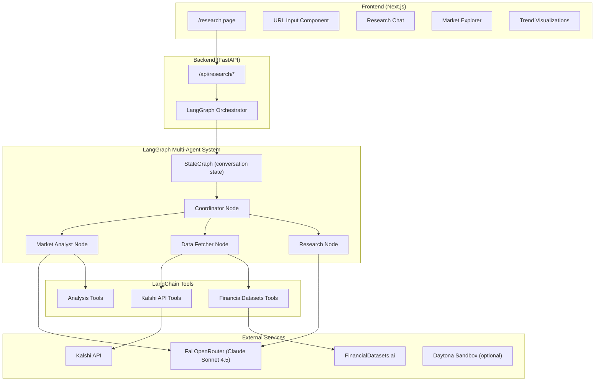

# Kalshi Research Page Implementation Plan

## Overview
Build a market research dashboard with multi-agent AI architecture using **LangChain + LangGraph** for stateful, multi-step reasoning. Features Kalshi URL analysis, market trend exploration, and autonomous financial research powered by specialized agents using Claude Sonnet 4.5 via Fal OpenRouter.

## Architecture

## Phase 1: Backend Infrastructure

### 1.1 New Environment Variables
Add to backend/.env.example and backend/app/config.py:
- FAL_KEY - Fal API key for OpenRouter LLM
- FIN_DATASET_KEY - FinancialDatasets.ai API key
- DAYTONA_API_KEY - Daytona sandbox (optional)
- DAYTONA_SERVER_URL - Daytona server URL (optional)

### 1.2 Dependencies
Add to backend/requirements.txt:
- langchain>=0.3.0
- langchain-core>=0.3.0
- langgraph>=0.2.0
- langchain-openai>=0.2.0
- fal-client>=0.5.0

### 1.3 Fal LLM Client (LangChain Compatible)
Create backend/app/llm/fal_client.py:
- Custom LangChain LLM wrapper for Fal OpenRouter
- Model: anthropic/claude-sonnet-4.5
- Support streaming for chat interface
- Implement BaseChatModel interface

### 1.4 LangGraph Multi-Agent System
Create backend/app/agents/:

State Schema (state.py) - TypedDict with messages, query, market_data, analysis, next_agent

Graph Definition (graph.py) - StateGraph with conditional routing

Coordinator Node (nodes/coordinator.py) - Query intent analysis, routing

Market Analyst Node (nodes/market_analyst.py) - Probability analysis, comparisons

Data Fetcher Node (nodes/data_fetcher.py) - API integrations via tools

Research Node (nodes/researcher.py) - Deep analysis, reports

### 1.5 LangChain Tools
Create backend/app/agents/tools/:
- kalshi_tools.py - parse_kalshi_url, get_market_details, get_orderbook
- financial_data_tools.py - get_crypto_prices, get_stock_prices
- analysis_tools.py - calculate_implied_probability, calculate_expected_value

## Phase 2: Research API Endpoints

Create backend/app/routers/research.py:
- POST /api/research/analyze-url - Analyze a pasted Kalshi URL
- POST /api/research/chat - Chat with research agent (streaming)
- GET /api/research/trending - Get trending markets
- GET /api/research/market/{ticker} - Deep market analysis
- POST /api/research/compare - Compare multiple markets

## Phase 3: Frontend Research Page

### 3.1 Page Structure
Create frontend/app/research/page.tsx:
- Header with navigation (Dashboard | Research | Trading Bot)
- Three-panel layout: Explorer | Main Content | Chat

### 3.2 Components
Create frontend/components/research/:
- url-analyzer.tsx - Paste URL, auto-analyze
- research-chat.tsx - Chat with streaming responses
- market-explorer.tsx - Browse markets by category
- trending-markets.tsx - Hot markets with volume
- market-card.tsx - Compact market display
- analysis-panel.tsx - AI analysis display

## File Structure

backend/app/
├── config.py (update)
├── llm/
│   ├── __init__.py
│   └── fal_client.py
├── agents/
│   ├── __init__.py
│   ├── state.py
│   ├── graph.py
│   ├── nodes/
│   │   ├── __init__.py
│   │   ├── coordinator.py
│   │   ├── market_analyst.py
│   │   ├── data_fetcher.py
│   │   └── researcher.py
│   └── tools/
│       ├── __init__.py
│       ├── kalshi_tools.py
│       ├── financial_data_tools.py
│       └── analysis_tools.py
└── routers/
    └── research.py

frontend/
├── app/
│   └── research/
│       └── page.tsx
├── components/
│   └── research/
│       ├── url-analyzer.tsx
│       ├── research-chat.tsx
│       ├── market-explorer.tsx
│       ├── trending-markets.tsx
│       ├── market-card.tsx
│       └── analysis-panel.tsx
└── lib/
    └── api.ts (update)

## Implementation Order

1. Environment & Dependencies - Config, requirements.txt
2. Fal LLM Client - LangChain-compatible wrapper
3. LangChain Tools - Kalshi, FinancialDatasets, Analysis
4. LangGraph Agents - State, Graph, Nodes
5. API Endpoints - FastAPI router
6. Frontend Page - Layout, navigation
7. Frontend Components - URL analyzer, chat, explorer
